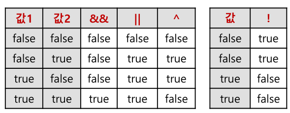
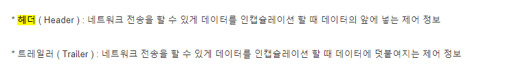

```
?오전 - 연산자
?오후 - 네트워크 특강
```

## 오전 
- 나누기 할 때 주의할 점 `ex) 7/2` 
  - 분모가 만약 0이 되면? 
- 증감연산자 
  - 전위형
  ```java
  int a = 3;
  int b = ++a;
  System.out.println(a);  // 4
  System.out.println(b);  // 4
  ```
  - 후위형
   ```java
  int a = 3;
  int b = a++ ;
  System.out.println(a); // 4
  System.out.println(b); // 3
  ```
- 자바에서 메모리 관리를 직접 안해도 됐기 때문 --> 비트연산자 사용 잘 안함 
  - 오랫동안 구동이 가능함.  --> 가전제품
  - 메모리 할당을 직접적으로 하지 x
```java
- 비트값 읽는 법
- 부호비트 : 첫번째 비트 (0:양수, 1: 음수)
- 양수 읽는 법 : 1을 기준으로 값 읽음
- 음수 읽는 법 : 0을 기준으로 값 읽음 + 1
```
- 쉬프트연산자 (<<, >>, >>>)

- 비교연산자 
  - api에 적어놓고도 헷갈려서 할 수 있기 때문에, `초과, 이상` 라는 표현으로 통일한다. 표현을 명확하게 한다.
  - 자바에서 등호(=)가 다른 부호와 함께 사용되는 경우
  등호는 항상 오른쪽에 위치함
```java
 등가비교는 stack메모리의 값을 비교
 - 기본자료형 (값비교) / 참조자료형 (번지비교)
int a=3, b=3;
System.out.println(a==b); //true
String a = new String(“안녕”);
String b = new String(“안녕”);
System.out.println(a==b); //false
```
- ? 등가비교 (==)는 대입연산자(=)와 반드시 구분
- 논리연산자 (&&, ||, ^, !)

- code readbility: 가독성 
  - 컨벤션, tab/spacebar 룰로 규정 
  - 커밋할 때 `checkstyle` 플러그인
- 대입연산자 (=, +=, -=, *=, /=, &=, |=, >>=, <<=, >>>=)
  - 오른쪽의 연산결과를 ?왼쪽에 대입
- 삼항연산자 `(참 또는 거짓)?" x: y` EOD
  - (참 또는 거짓): 비교연산자, 논리연산자
  - x: 참인 경우
  - y: 거짓인 경우  
### 제어문과 제어 키워드
- ```java
    if(조건식) {
    실행내용; → 조건식이 true일 때만 실행
    } 
    boolean(true, false) 타입만 가능```
- break: if문을 제외한 가장 가까운 중괄호({ })를 탈출
- if vs switch? : 결론 성능은 거의 같다.  
  - 내 코드대로 돌아간다는 보장 x, 최적화가 어떻게 되느냐에 따라서도 다르다. 
---

## 오후 
### 네트워크 수업
-  TTL : Time to Library(타임 제한)
- 단편화의 오프셋
- CIDR 표기법
- NAT : 외부에서 - 내부로는 공인 IP 사용
- ip: 신뢰할 수 없는 통신, 비연결형 통신 
- 프록시, 리버스 프록시 
- xpath
- 커넥션 풀

### Jira/Confluence 
- 애자일
- 스크럼: 매일 15분정도 Scrum meeting (Daily Scrum)
  - 수평적인 대화.
  - 2주는 test, 배포까지 포함 
- 스프린트
- PO 
- Daily Stand-up Meeting: 어제한 일, 오늘 할 일, 장애요소 
- Backlog 업데이트: 업무 추가, 보완, 우선순위
- 업무 수행
- Epic: 큰 업무 덩어리, 여러 개의 태스크로 쪼개질 수 있음
- Story: 유저 스토리(제공되는 기능:ex로그인 등), 엔드 유저의 관점에서 쓰여진 간단한 요구 사항
  - 하나의 심플한 이야기라고 할 수 있음 
  - 연관된 스토리들이 모여서 하나의 에픽을 생성 (큰 건 쪼개고, 작은걸 나열)
- Task: ex) EC2에 있는 것 계정 등록 등 부가적으로 할 일 
- 이니셔티브는 에픽 이상의 또 다른 수준의 구조 제공(잘 안 씀) ( 그 이상에는 테마가 있다.)
### Confluence
- 최근 원본 하나만 남기고 다 히스토리로... 
- hierarchy 를 통한 구조화된 문서 구조 제공
- 

### Trello
---

### 용어 
- Easy of Development : EOD
- 패러럴 컴파일 : 모듈별 하나로 모아서 
- 천공카드 
- 자기테이프
- 댕글링포인터
- ISP 
- CDM 주파수를 쪼개서 
- traceroute
- 헤더와 트레일러 
  - 헤더: 출발 ip, 목적ip, 패킷 길이, 오류 검출코드 등.. 
  - 
- telnet google.com 80
  - 여기에 GET /index.html HTTP/1.0 --> 프로토콜
- 웹소켓

### 자바 수업
- 

---


### 코멘트
```text
- 다른 사람이 읽기 위한 글을 써야한다. 읽는 사람을 위한 글쓰기가 되어야 한다. 
- 코드도 마찬가지이다. 
- 나 보기 위한 건 공유할 필요x
- 클론코딩 하지x (왜 이걸 왜 만들었어요? 물음에 대답하지 못하면 안된다.)
- 뭐라도 해보고, 계속 손으로 쳐보자. 영타라도 쳐보자.
```

### 프로젝트 
- 문제: 워치에서 받아올 방법이 없다. 
  - Web으로 하려고 했었음. 그러나 방법x (sdk로만 접근)
  - 웨어러블 기기를 폰으로 정보를 받아 BE(api)에 전송만 하면 된다. sdk 안드로이드 샘플소스 코드는 많이 있다. 
  - 서버 쪽에 수집된 데이터를 쏘는 것만 하면.. 바로 deploy 가능하다. 
- 성과를 내는 사람: 될 수 있는 방법에 대한 질문을 한다.
- 어려운거 하지마세요.. 가장 쉽게 데이터 수집할 수 있는 것 
- added value
- 모바일 웹으로 할거다 (pwa 등)
  - 웹에서도 위도 경도 정보값 api제공, 기존의 것이 왜 불편한가 -- ai 통해서 조금만 바꿔 다른 것을 제공, 길을 선으로 표시해주던지 
  - 장애인들 인터뷰도 해보고.. 맘카페 
  - 사용자 의견 찾아보기
- 하지 말아야 할 것: 노가다 한 것--> ai 모델을 위해 노력해야하는건 절대x
  - 3개월 내로 답이 안나옴
  - 최대한 가져쓰고, 개선--> 그럴싸한 것을 만들어내야한다. 
- ai를 쓰기 위해 필요없는 서비스를 만드는 것이다. 
- 경사도가 있는 곳은 못가게 

- 문제를 푸는데 ai를 써야하지, 문제를 푸는데 ai를 만들 생각하지 x
- 클라우드, openai, lima 등 붙여서.. 