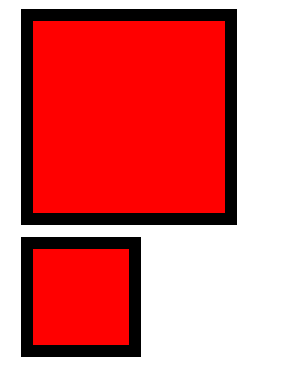
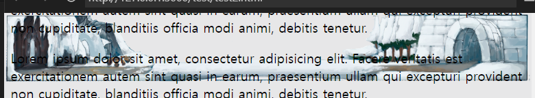
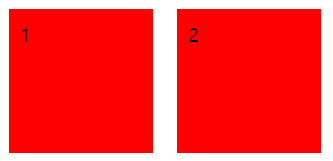
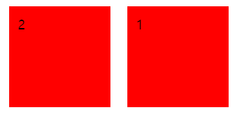
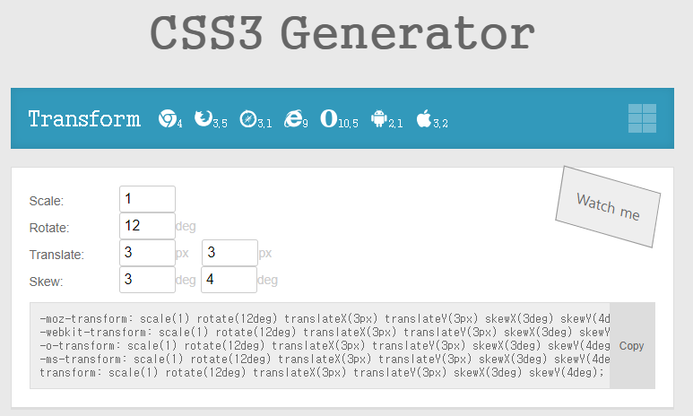
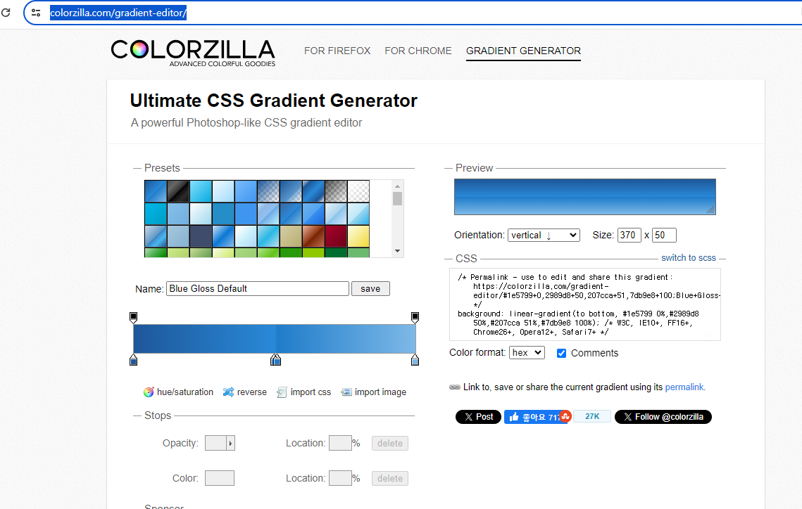

```
오전: 생리통으로 지각
오후: 12:40 도착
```
## CSS
- [색상 고르기](https://www.webfx.com/web-design/color-picker/)
- 보통은 헥사 단위의 컬러 사용 

### display
- none : 태그를 화면에서 보이지 않게 한다.
- block: 태그를 block 형식으로 지정한다. 
- inline: 태그를 inline 형식으로 지정한다. 
- inline-block: 태그를 inline-block 형식으로 지정한다. 

### visibility
- visible : 태그를 보이게 만듭니다. 
- hidden : 태그를 보이지 않게 만든다. 
- collapse: 테이블 관련 요소에서 사용됩니다. 테이블의 행, 열 또는 그룹을 보이지 않게 하고 공간도 차지하지 않게 합니다.
- 배치 방식
  - inline-block: 요소가 인라인 요소처럼 같은 줄에 배치됩니다. 다른 인라인 요소와 마찬가지로 좌우로 나란히 배치되지만, 블록 요소처럼 너비와 높이를 지정할 수 있습니다.
  - block: 요소가 항상 새로운 줄에서 시작되며, 가능한 전체 너비를 차지합니다.
- 레벨 속성
  - inline-block: 인라인 레벨 요소이므로, 다른 인라인 요소와 함께 같은 줄에 위치할 수 있습니다. 
  - block: 블록 레벨 요소이므로, 항상 새로운 줄에서 시작합니다.
- 크기 제어
  - inline-block: 요소의 너비와 높이를 설정할 수 있습니다. 기본 인라인 요소와 달리 크기를 조절할 수 있습니다.
  - inline: 너비와 높이를 지정할 수 없으며, 콘텐츠의 크기에 맞춰집니다.

### box-sizing
- content-box: 요소의 너비와 높이가 내용만을 포함. 패딩과 테두리는 제외.
- (일반적)`border-box`: 요소의 너비와 높이에 패딩과 테두리가 포함. 총 크기를 유지하면서 내용 영역이 차감됨.
- 

### background-image
- background-size: 100% 250px;
- 콤마(,)를 넣는 경우
>콤마를 넣는 경우
각각의 배경 이미지에 대해 별도의 크기를 지정합니다. 예를 들어, 두 개의 배경 이미지가 있고, 첫 번째 이미지는 100% 1000%, 두 번째 이미지는 자동 크기를 갖도록 지정할 수 있습니다.
- 콤마를 넣지 않는 경우
>콤마를 넣지 않고 background-size 속성을 하나의 값으로 지정하면, 그 값이 모든 배경 이미지에 동일하게 적용됩니다. 즉, 여러 개의 배경 이미지가 있더라도 같은 크기로 설정됩니다.

### background-attachment
- background-attachment: fixed;
- 

### font-size
- em 단위
부모 요소의 폰트 크기에 상대적인 배수로 크기를 지정합니다.
반응형 디자인에서 유용하게 사용됩니다.
중첩된 요소의 폰트 크기 계산에 유리합니다.

### position 속성 
- static: 태그가 위에서 아래로 순서대로 배치
- relative: 초기 위치 상태에서 상하좌우로 위치를 이동
- absolute: 절대 위치 좌표를 설정
- fixed: 화면을 기준으로 절대 위치 좌표를 설정

### overflow
- hidden: 부모태그 바깥은 잘림
- scroll

### float
- float: left; 속성이 적용된 이미지는 왼쪽으로 부유하여 텍스트의 주변으로 이동하면서 배치됩니다.
- 플로팅 요소: 해당 요소가 다른 요소의 주변으로 이동하면서 배치됩니다.
- 텍스트 플로팅: 이미지나 그림과 같은 요소를 텍스트의 주변으로 배치할 때 유용합니다.
- 다중 열 레이아웃: 다중 열 레이아웃을 만들 때 사용되어, 여러 요소들이 나란히 배치되도록 돕습니다.
- 부모 요소의 높이 조절: 부모 요소가 자식 요소들의 높이를 반영하도록 하지 않습니다. 따라서 부모 요소의 높이를 조절하려면 clear 속성을 사용하여야 합니다.
>- 주의사항
float 속성을 사용하면 요소가 부유하여 다른 요소와 겹치거나 레이아웃을 깨뜨릴 수 있습니다. 이를 방지하기 위해 clear 속성을 사용하여 해당 요소의 뒤에 오는 요소들을 클리어할 수 있습니다.
부모 요소에 overflow: hidden; 속성을 적용하면 float 속성이 적용된 자식 요소들의 높이를 반영할 수 있습니다.
- 요약
float: left; 속성은 해당 요소를 왼쪽으로 부유시켜서 다른 요소들의 주변으로 이동하면서 배치합니다. 텍스트와 이미지를 나란히 배치하거나 다중 열 레이아웃을 만들 때 유용하게 사용됩니다. 그러나 요소가 부유하면서 레이아웃이 깨질 수 있으므로, 사용할 때에는 주의가 필요합니다.
- float: left;
  - 
```html
<!DOCTYPE html>
<html lang="en">
<head>
  <meta charset="UTF-8">
  <meta name="viewport" content="width=device-width, initial-scale=1.0">
  <title>Document</title>
  <style>
      .box{
          width:100px; height:100px;
          background-color: red;
          margin:10px; padding:10px;
          float: left; /*right*/
      }
  </style>
</head>
<body>
  <div class="box">1</div>
  <div class="box">2</div>
</body>
</html>
```
- float:right;
  - 

- 겹쳐서 오른쪽에 붙는 경우:overflow:hidden;으로 내려버려야 한다. 

### section잡기
```html
<!DOCTYPE html>
<html lang="en">
<head>
    <meta charset="UTF-8">
    <meta name="viewport" content="width=device-width, initial-scale=1.0">
    <title>Document</title>
    <style>
        /* body 태그를 중앙 정렬합니다.*/
        body{
            width: 960px;
            margin: 0 auto;
        }
        .clear{
          clear:both
        }
        #aside{
            width: 200px;
            float:left;
        }
        #section{
            width: 760px;
            float: left;
        }
        #wrap{
            overflow: hidden;
        }
    </style>
</head>
<body>
    <div id="header"><h1>Header</h1></div>
    <div id="navigation"><h1>Navigation</h1></div>
    <div id="wrap">
        <div id="aside">
            <h1>Aside</h1>
            <p>Lorem ipsum dolor sit amet consectetur adipisicing elit. Dolorem facilis illo, sit ea repudiandae assumenda deleniti architecto commodi, rem dolores eum voluptatem officiis quam? Impedit vitae provident ducimus unde minima?</p>
        </div>
        <div id="section">
            <h1>section</h1>
            <p>Lorem ipsum dolor sit amet consectetur adipisicing elit. Illum cupiditate quidem quos ex minus nam? Saepe est perspiciatis, placeat distinctio aut neque asperiores, voluptatum blanditiis ea facere officiis, sit mollitia.</p>
        </div>
    </div>
    <div id="footer"><h1>Footer</h1></div>
</body>
</html>
```
### clear: both; 
- CSS 속성은 float 속성이 적용된 요소들의 영향을 방지하기 위해 사용됩니다. 
- float 속성이 적용된 요소들은 주변 요소들의 텍스트와 겹칠 수 있으며, 
이때 clear 속성을 사용하여 해당 요소의 플로팅 효과를 해제하고 주변 요소들과 겹치지 않도록 만들 수 있습니다.
```css
.selector {
    clear: both;
}
```
### CSS3 Generator
- [CSS3 Generator](https://css3generator.com/)

- 
### COLORZILLA
- [Gradient](https://www.colorzilla.com/gradient-editor/)

### 벤더 프리픽스
- 벤더 프리픽스(vendor prefix)는 웹 브라우저 제작자(벤더)별로 특정 CSS 속성을 지원하기 위해 사용되는 접두사(prefix)입니다. 
이러한 접두사는 웹 표준이나 CSS 스펙에 아직 포함되지 않은 속성이나 기능을 브라우저 제작자가 실험적으로 지원할 때 사용됩니다. 이렇게 실험적으로 지원되는 속성이나 기능은 해당 브라우저에서만 정상적으로 작동할 수 있으며, 다른 브라우저에서는 지원되지 않거나 제대로 동작하지 않을 수 있습니다.
- 예를 들어, border-radius 속성은 둥근 테두리를 만드는데 사용됩니다. 하지만 이 속성은 초기에 표준 CSS 스펙에 포함되지 않았기 때문에 각 브라우저 제작자들은 이 속성을 지원하기 위해 자체적으로 접두사를 추가했습니다. 그 결과, 다양한 브라우저에서는 -webkit-border-radius (WebKit 기반 브라우저), -moz-border-radius (Mozilla Firefox), -ms-border-radius (Internet Explorer), -o-border-radius (Opera)와 같은 형태로 사용되었습니다.
- 벤더 프리픽스는 주로 CSS3의 새로운 기능이나 실험적인 기능을 지원하기 위해 사용되며, 이러한 기능이 표준 스펙에 포함되고 브라우저 간 일관된 지원이 이루어질 때까지 임시적으로 사용됩니다. 
그러나 이러한 접두사를 사용하는 것은 코드의 복잡성을 증가시키고 유지보수를 어렵게 만들 수 있으므로, 가능한 한 표준 속성을 사용하는 것이 권장됩니다.
- 대부분의 경우, CSS3 속성에 대한 벤더 프리픽스는 자동으로 추가되는 CSS 전처리기(preprocessor)를 사용하여 생성할 수 있습니다. 또는 온라인 툴이나 자동 생성 도구를 사용하여 벤더 프리픽스를 추가할 수도 있습니다. 최신의 웹 개발 툴과 프레임워크는 대부분 이러한 작업을 자동화하여 개발자가 편리하게 사용할 수 있도록 지원하고 있습니다.

### transition-duration
```html
<!DOCTYPE html>
<html lang="en">
<head>
    <meta charset="UTF-8">
    <meta name="viewport" content="width=device-width, initial-scale=1.0">
    <title>Document</title>
    <style>
        .box{
            width:100px; height:100px;
            background-color: orange;
            transition-duration: 2s;
        }
        .box:hover{
            width: 200px;
            height:300px;
        }
        .box:active{
            background-color: red;
        }
    </style>
</head>
<body>
    <div class="box"></div>
</body>
</html>
```

- transition: 
- trnsition-delay: 이벤트 발생 후 몇 초 후 재생할지 지정
- transition: 모든 transition 속성을 한 번에 사용

```html
<!DOCTYPE html>
<html lang="en">
<head>
    <meta charset="UTF-8">
    <meta name="viewport" content="width=device-width, initial-scale=1.0">
    <title>Document</title>
    <style>
        #graph{
            width: 610px;
            border : 3px solid black;
        }
        .bar{
            width: 10px; height:50px;
            background-color: orange;
            margin: 5px;
            transition-duration: 5s;
        }
        #graph:hover > .bar{
            width: 600px;
        }

        /* .box{
            width:100px; height:100px;
            background-color: orange;
            transition-duration: 2s;
        }
        .box:hover{
            width: 200px;
            height:300px;
        }
        .box:active{
            background-color: red;
        } */
    </style>
</head>
<body>
    <!-- <div class="box"></div> -->
    <div id="graph">
        <div class="bar"></div>
        <div class="bar"></div>
        <div class="bar"></div>
        <div class="bar"></div>
        <div class="bar"></div>
    </div>
</body>
</html>
```

###  Cubic-beizer

- [부드럽게 진행](https://cubic-bezier.com/#.17,.67,.83,.67)