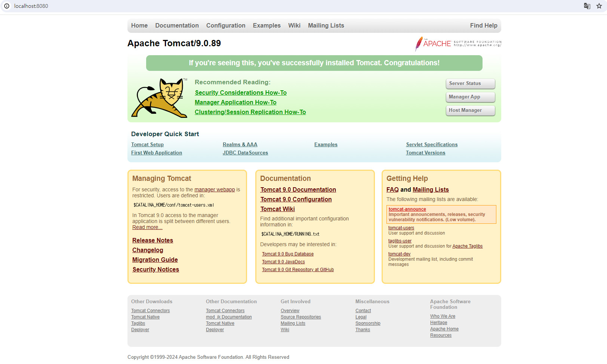
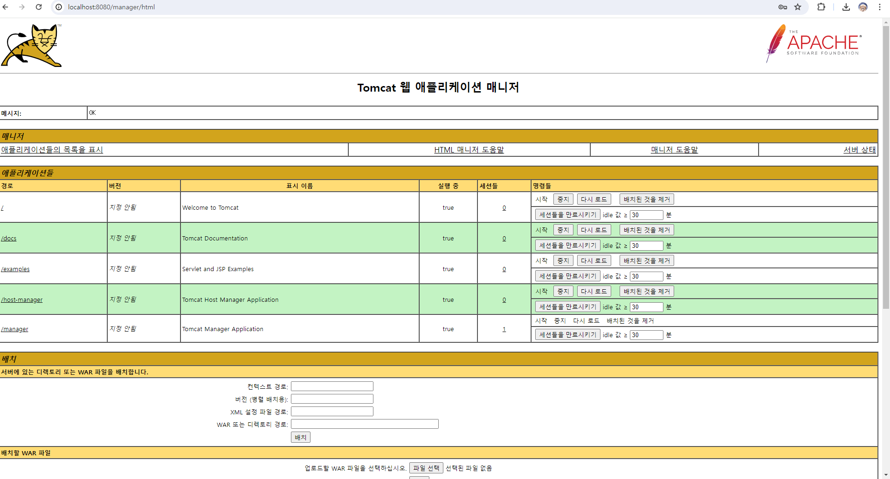
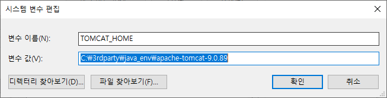
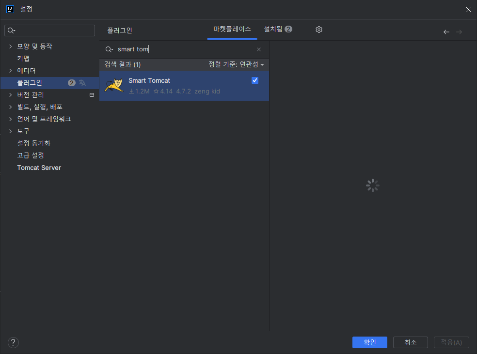
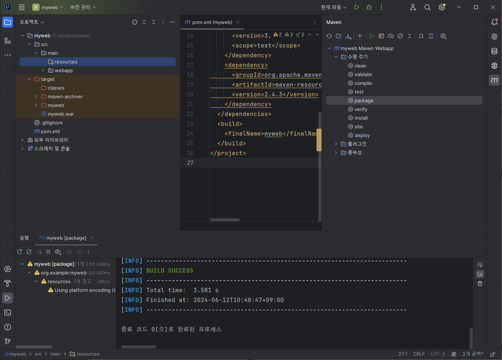

```
오전: tomcat 설치
오후: AWS 계정으로 
```
## 용어 
- 애뮬레이터: git bash 
- 윈도우에서는 잘 안되니까, 애뮬레이터를 만듦 

## 오전 

### 1. Tomcat 설치 
- 자바는 3년마다 버전 업그레이드를 권장
- [9.0.89 버전 설치](https://tomcat.apache.org/download-90.cgi)
1. C드라이브 - 3rdparty 폴더 - java_env에 압축 푼 폴더 옮기기 
2. powershell 에서 
C:\3rdparty\java_env\apache-tomcat-9.0.89\bin 디렉토리에서 
```shell
tomcat/bin/stutdown.sh or shutdown.bat
tomcat/bin/startup.sh or startup.bat
```
- 윈도우에서 실행할 경우 shutdown.bat / .sh는 리눅스계열
- localhost:8080 들어갈 경우 
    - 
### 3. Tomcat의 Manager 애플리케이션에 접근
- Tomcat 서버의 관리와 배포를 쉽게 할 수 있도록 여러 가지 기능을 제공합니다.
- conf/tomcat-users.xml -> vscode 연 다음, 
주석 해제하고 
```xml
  <role rolename="tomcat"/>
  <role rolename="manager-gui"/>
  <role rolename="manager-script"/>
  <role rolename="manager-jmx"/>
  <role rolename="manager-status"/>
  <user username="admin" password="tomcat" roles="tomcat,manager-gui,manager-script,manager-jmx,manager-status"/>
  <!-- 이렇게 설정 변경하기 />


  <!-- <role rolename="tomcat"/>
  <role rolename="role1"/>
  <user username="tomcat" password="<must-be-changed>" roles="tomcat"/>
  <user username="both" password="<must-be-changed>" roles="tomcat,role1"/>
  <user username="role1" password="<must-be-changed>" roles="role1"/> -->

```
- http://localhost:8080/manager/html 접속 후 admin  비번 tomcat으로 로그인 접속
    - 
### Tomcat Manager 애플리케이션의 주요 기능
1. 애플리케이션 배포 및 관리:
            - WAR 파일을 업로드하여 새로운 웹 애플리케이션을 배포할 수 있습니다.
    - 이미 배포된 애플리케이션을 시작, 중지, 재시작, 제거할 수 있습니다.
2. 상태 모니터링:
    - 현재 배포된 애플리케이션들의 상태를 확인할 수 있습니다.
    - 서버의 전체적인 상태와 성능 지표를 모니터링할 수 있습니다.
3. 서버 정보:
    - Tomcat의 버전 정보와 시스템 정보를 확인할 수 있습니다.
    - 현재 서버에 로드된 모든 애플리케이션의 리스트와 상태를 확인할 수 있습니다.
4. 일괄 작업:
    - 여러 애플리케이션에 대해 일괄적으로 작업을 수행할 수 있습니다.
### 4. 환경 변수 설정 (TOMCAT_HOME)
- 
- 명령 프롬프트 창 열고, `echo %TOMCAT_HOME%` 실행하면 디렉토리가 뜬다. 
<br>
<br>
### 참고 디렉토리 webapps 설명 
> Tomcat 설치 후 webapps 폴더는 Tomcat 서버에 배포된 웹 애플리케이션들이 위치하는 기본 디렉토리입니다. 이 폴더 안에는 Tomcat을 설치하면 기본적으로 포함되는 여러 서브 폴더가 있습니다. 각 폴더의 역할은 다음과 같습니다:

### 기본 포함 폴더
1. ROOT:
    - http://localhost:8080/ URL로 접속할 때 기본으로 보여주는 웹 애플리케이션입니다.
    - 일반적으로 Tomcat의 기본 환영 페이지가 이곳에 위치합니다.
    - 필요에 따라 이 디렉토리에 자체 웹 애플리케이션을 배포하여 기본 애플리케이션을 대체할 수 있습니다.
2. docs:
    - Tomcat에 대한 문서화 파일들이 위치하는 디렉토리입니다.
    - http://localhost:8080/docs/로 접근할 수 있습니다.
    - Tomcat의 사용법, 설정 방법, API 레퍼런스 등 다양한 문서를 포함하고 있습니다.
3. examples:
    - Tomcat의 기능을 설명하고 예제를 제공하는 웹 애플리케이션입니다.
    - http://localhost:8080/examples/로 접근할 수 있습니다.
    - JSP, Servlet, WebSocket 등 다양한 기술에 대한 예제 코드가 포함되어 있습니다.
4. host-manager:
    - Tomcat의 Host Manager 애플리케이션입니다.
    - http://localhost:8080/host-manager/로 접근할 수 있습니다.
이 애플리케이션을 통해 Tomcat의 가상 호스트를 관리할 수 있습니다.
기본적으로 관리자 권한이 필요하며, conf/tomcat-users.xml 파일에서 사용자 계정을 설정해야 합니다.
5. manager:
    - Tomcat의 Manager 애플리케이션입니다.
    - http://localhost:8080/manager/html로 접근할 수 있습니다.
    - 이 애플리케이션을 통해 웹 애플리케이션의 배포, 제거, 재시작 등을 관리할 수 있습니다.
    - 역시 관리자 권한이 필요하며, conf/tomcat-users.xml 파일에서 사용자 계정을 설정해야 합니다.
### 사용자 배포 애플리케이션
1. 사용자 정의 애플리케이션 폴더:
    - 사용자가 Tomcat에 배포하는 각 웹 애플리케이션은 webapps 폴더에 개별 디렉토리로 위치하게 됩니다.
    - 예를 들어, myapp이라는 애플리케이션을 배포하면, webapps/myapp 폴더가 생성되고, http://localhost:8080/myapp/로 접근할 수 있습니다.

### 배포 방식
1. 디렉토리 배포:
    - 애플리케이션을 직접 webapps 폴더 내에 디렉토리로 배포합니다. 이 경우, 해당 디렉토리 구조가 웹 애플리케이션의 루트가 됩니다.
2. WAR 파일 배포:
    - 웹 애플리케이션을 WAR(WEB Application Archive) 파일로 패키징하여 webapps 폴더에 배포합니다.
    - Tomcat은 자동으로 WAR 파일을 풀어서 해당 디렉토리를 생성하고 애플리케이션을 배포합니다.
### 주의 사항
- 보안:
    - 기본적으로 배포된 manager와 host-manager 애플리케이션은 보안에 민감할 수 있습니다. 이러한 애플리케이션에 접근할 수 있는 사용자를 엄격히 관리해야 합니다.
conf/tomcat-users.xml 파일에서 접근 권한을 설정할 때 강력한 비밀번호 정책을 사용하는 것이 좋습니다.
- 디렉토리 정리:
    - 불필요한 애플리케이션은 webapps 폴더에서 제거하여 디스크 공간을 절약하고, 보안을 강화할 수 있습니다.
> webapps 폴더는 Tomcat 서버의 핵심 부분으로, 배포된 애플리케이션들을 효과적으로 관리하고 구성하는 데 중요한 역할을 합니다. 이를 잘 활용하면 Tomcat 서버를 효율적으로 운영할 수 있습니다.

<br><br>

## IntelliJ 사용하기 
- 설정 - 플러그인에서 `Smart Tomcat` 설치하기 
    - 
- Settings: 글로벌 설정
- Project Strucutre: 프로젝트 단위 설정
### Maven으로 프로젝트 생성하기 
- myweb Maven Webapp
- 수명 주기는 하나씩 누적되어 사용된다고 보면 됨.

- resources : java가 아닌 다른 파일들 

### WEB-INF
> WEB-INF와 web.xml은 Java 웹 애플리케이션에서 중요한 역할을 하는 두 가지 요소입니다. 이들은 주로 Java Servlet 기반 웹 애플리케이션을 구성하고 설정하는 데 사용됩니다.

<b>WEB-INF</b>
- WEB-INF는 Java 웹 애플리케이션의 배포 디렉토리 구조 내에 있는 특별한 디렉토리입니다. 이 디렉토리는 다음과 같은 중요한 목적을 가지고 있습니다:

- 보안
    - WEB-INF 디렉토리에 있는 파일들은 클라이언트(웹 브라우저)에서 직접 접근할 수 없습니다. 
    - 이로 인해 중요한 설정 파일이나 라이브러리 파일을 이 디렉토리에 안전하게 저장할 수 있습니다.
- 구성
    - 이 디렉토리는 웹 애플리케이션의 구성 파일(web.xml)과 라이브러리 파일(lib 디렉토리)을 포함합니다.
- 컴파일된 클래스 파일
    - WEB-INF/classes 디렉토리는 애플리케이션의 컴파일된 Java 클래스 파일들을 저장합니다.


## Jar 파일과 War 파일 
### Jar(Java Archive) 파일
#### 장점
- 독립적인 Java 애플리케이션을 패키징
- 압축된 형식으로 클래스, 리소스, 라이브러리 등을 포함하므로 배포와 전달이 용이하다.
- Java 애플리케이션의 진입점인 main 메서드를 포함하고 있어 <b>JVM에서 직접 실행하기 때문에 별도의 웹 컨테이너나 서버가 필요하지 않다.</b>

#### 단점
- 웹 애플리케이션을 개발할 때는 WAR 파일에 비해 제약사항이 있다. 
    - 예를 들어, JSP나 서블릿 컨테이너에 대한 표준 기능을 활용하기 어렵다.
- 웹 애플리케이션에서 동적인 웹 컨텐츠 생성 및 관리가 제한적이다.

### War (Web Archive) 파일
#### 장점
> Java 웹 애플리케이션을 패키징하는 데 최적화되어 있고, 웹 구성 요소인 JSP, 서블릿, 필터, 리스너 등과 웹 애플리케이션을 실행하기 위한 서블릿 컨테이너(웹 컨테이너)에서 필요한 설정 파일, 라이브러리, 리소스 등을  포함하여 한 번에 배포 및 실행할 수 있습니다.
- 웹 컨테이너(서블릿 컨테이너)를 통해 애플리케이션을 실행하므로 다양한 웹 기능과 서버 환경을 활용할 수 있다.

#### 단점
- 웹 컨테이너나 서버에 종속적이기 떄문에 특정한 웹 컨테이너 환경이 필요하다. 
- 배포 및 전달에 있어 JAR 파일에 비해 크기가 크고 번거로울 수 있다. 
### 차이점 요약
- JAR 파일은 독립적인 Java 애플리케이션을 패키징하는 데 적합하며, 실행 가능한 JAR 파일로 개발자가 쉽게 실행할 수 있다. 
- 반면, WAR 파일은 Java 웹 애플리케이션을 패키징하고 실행하는 데 적합하며, 웹 컨테이너를 통해 다양한 웹 기능을 활용할 수 있다. 즉, JAR은 독립적인 실행 가능한 애플리케이션을 구성하는 것을 목표로 하고, WAR 파일은 웹 환경에서 실행되는 애플리케이션을 구성하는 것을 목표로 한다.

## 디렉토리와 패키지의 차이 
### 개념적 차이:
- 디렉토리: 파일 시스템의 물리적 구조.
- 패키지: 프로그래밍 언어에서 관련 클래스와 인터페이스의 논리적 그룹화.
### 목적:
- 디렉토리: 파일과 디렉토리를 조직하고 관리.
- 패키지: 네임스페이스 관리, 코드 조직화, 접근 제어, 모듈화.
### 사용 맥락:
- 디렉토리: 운영체제와 파일 시스템 전반.
- 패키지: 주로 소프트웨어 개발과 특정 프로그래밍 언어.
### 구조:
- 디렉토리: 폴더 안에 파일이나 다른 폴더가 있는 계층 구조.
- 패키지: 프로그래밍 언어 내의 클래스와 인터페이스가 포함된 논리적 그룹.

## 서블릿과 main 메소드의 차이점
### main 메소드
- 일반적인 Java 애플리케이션의 진입점으로, JVM에 의해 실행되며 애플리케이션의 시작 지점을 정의합니다.
### 서블릿
- 웹 컨테이너에 의해 관리되며, main 메소드가 아닌 서블릿 컨테이너가 서블릿의 생명 주기를 관리합니다. 클라이언트의 요청에 따라 서블릿 컨테이너가 서블릿의 service() 메소드를 호출하고, 이 메소드가 요청을 처리하는 데 필요한 적절한 메소드(doGet(), doPost() 등)를 호출합니다.
### 실행 흐름
#### 서블릿 배포
- 서블릿은 WAR 파일의 형태로 웹 애플리케이션에 포함되어 웹 컨테이너에 배포됩니다.
#### 서블릿 로드
- 클라이언트 요청이 처음으로 들어오면 서블릿 컨테이너는 서블릿을 로드하고 init() 메소드를 호출합니다.
#### 요청 처리
- 각 클라이언트 요청에 대해 서블릿 컨테이너는 service() 메소드를 호출하고, 이 메소드는 요청 메소드에 따라 적절한 핸들러(doGet(), doPost() 등)를 호출합니다.
#### 서블릿 언로드
- 웹 애플리케이션이 중지되거나 서블릿이 제거될 때, 서블릿 컨테이너는 destroy() 메소드를 호출하여 정리 작업을 수행합니다.

> 서블릿은 독립적인 애플리케이션이 아닌, 웹 컨테이너와의 협력을 통해 동작하는 서버 측 컴포넌트로, main 메소드는 없지만 컨테이너에 의해 관리되는 일련의 라이프사이클 메소드를 통해 요청을 처리합니다.

## 서블릿 실행시키기 
1. pom.xml 추가 
```xml
<dependency>
      <groupId>javax.servlet</groupId>
      <artifactId>javax.servlet-api</artifactId>
      <version>4.0.1</version>
    </dependency>
```

2. HelloServlet.java
```java
// 1. web.xml에 등록하여 실행시키기
package com.example;

import javax.servlet.ServletException;
import javax.servlet.http.HttpServlet;
import javax.servlet.http.HttpServletRequest;
import javax.servlet.http.HttpServletResponse;
import java.io.IOException;
import java.io.PrintWriter;

public class HelloServlet extends HttpServlet {
    @Override
    protected void doGet(HttpServletRequest req, HttpServletResponse resp) throws ServletException, IOException {
        resp.setContentType("text/html; charset=UTF-8");
        PrintWriter out = resp.getWriter();
        out.println("<h1>HiHi Hello World! merong</h1>");
        out.close();
        //super.doGet(req, resp);
    }
}
```
```xml
// web.xml 
<!DOCTYPE web-app PUBLIC
 "-//Sun Microsystems, Inc.//DTD Web Application 2.3//EN"
 "http://java.sun.com/dtd/web-app_2_3.dtd" >

<web-app>
  <display-name>Archetype Created Web Application</display-name>
  <servlet>
    <servlet-name>hello-servlet</servlet-name>
    <servlet-class>com.example.HelloServlet</servlet-class>
  </servlet>
  <servlet-mapping>
    <servlet-name>hello-servlet</servlet-name>
    <url-pattern>/HelloServlet</url-pattern>
  </servlet-mapping>
</web-app>

```
3. HiServlet - 애노테이션 방식 
```java
package com.example;

import javax.servlet.ServletException;
import javax.servlet.annotation.WebServlet;
import javax.servlet.http.HttpServlet;
import javax.servlet.http.HttpServletRequest;
import javax.servlet.http.HttpServletResponse;
import java.io.IOException;
import java.io.PrintWriter;

@WebServlet("/hi")
public class HiServlet extends HttpServlet {
    @Override
    protected void doGet(HttpServletRequest req, HttpServletResponse resp) throws ServletException, IOException {
        resp.setContentType("text/html; charset=UTF-8");
        PrintWriter out = resp.getWriter();
        out.println("<h2> hhhhhh </h2>");
        out.close();
    }
}
```
4. index.jsp 
```java
<html>
<body>
<h2>Helloooooo World!</h2>
</body>
</html>

```


# 오후
- pc -> intelliJ -> tomcat -> local
- AWS -> EC2 -> Tomcat -> Dev
- 프리티어(무료서버)에 설치해보기 
                    - LB
- team -> EC2 -> Tomcat (mySQL)
- 추후 프로젝트에 필요한 mysql 설치하고, 서버 3대씩 제공
- CI/CD 배포 자동화 
    - git flow 
- 가상 네트워크를 만들어서, 로드밸런서를 만드는 작업

## 적용 과정
### 1. sdkman 설치 
`curl -s "https://get.sdkman.io" | bash`

### 2. source 명령어 적용
`source "/home/ec2-user/.sdkman/bin/sdkman-init.sh"`

### 3. 환경 변수 설정 
`vi $HOME/.bash_profile`
`shift + G(명령모드인 상태에서 맨 아래로 이동) 후 복사(shift+insert)`

```shell
export SDKMAN_DIR="$HOME/.sdkman"
[[ -s "$SDKMAN_DIR/bin/sdkman-init.sh" ]] && source "$SDKMAN_DIR/bin/sdkman-init.sh"
```
- source 명령어 적용 : `source $HOME/.zshrc 혹은 source $HOME/.bashrc`


### 4. Java 설치(21.0.3 -오라클)
- 자바 설치 가능 버전 목록 확인
    - `sdk list java`
- 설치
    - `sdk install java 21.0.3-oracle`
- 자바 버전 확인
    - `java --version`
    - java 21.0.3 2024-04-16 LTS
Java(TM) SE Runtime Environment (build 21.0.3+7-LTS-152)
Java HotSpot(TM) 64-Bit Server VM (build 21.0.3+7-LTS-152, mixed mode, sharing)

### 5. sdkman에서 tomcat 설치 (9.0.88버전)
- 설치 
    - `sdk install tomcat 9.0.88`
#### 추가 변경 작업 3가지 
#### 1) chmod로 *(모든 사람에게) 권한 변경 주기 
    - chmod 755 *
- sdkman의 설치된 톰캣의 디렉토리에 들어가서, `?context.xml`과 `?tomcat-user.xml` 파일 변경
#### 2) context.xml 변경
- 경로 이동
    - `cd ~/.sdkman/candidates/tomcat/9.0.88/webapps/manager/META-INF/`
- `?vi context.xml`에서 이 해당 부분 변경
    - `?allow="\d+\.\d+\.\d+\.\d+|::1|0:0:0:0:0:0:0:1"`
    - 한줄씩 지우는 명령어: `(esc 누르면 명령모드에서) + dd`
    - 해당 부분 붙여넣기 `shift + insert`
```shell
<Context antiResourceLocking="false" privileged="true" >
<!--
  <Valve className="org.apache.catalina.valves.RemoteAddrValve"
         allow="\d+\.\d+\.\d+\.\d+|::1|0:0:0:0:0:0:0:1" />
-->
</Context>
```
#### 3) tomcat-user.xml에서 변경 내용
- 경로 이동 
    - `cd ../../../conf` 나온 다음
- `?vi tomcat-user.xml`에서 esc(명령어 모드) 누르고 shift+G
- 맨 마지막 주석 풀고 
  ```shell
  <role rolename="tomcat"/>
  <role rolename="manager-gui"/>
  <role rolename="manager-script"/>
  <role rolename="manager-jmx"/>
  <role rolename="manager-status"/>
  <user username="admin" password="tomcat" roles="tomcat,manager-gui,manager-script,manager-jmx,manager-status"/>
  ```

- 완료 후 LB(로드밸런서) 연결
- 본인 Intellij에서 java 파일 만든 후, maven에서 war 파일로 추출되면, 
- 인스턴스 각각 public ip에서 {본인 경로}:8080/manager/html에서 파일 업로드. 열리는지 확인해보기.