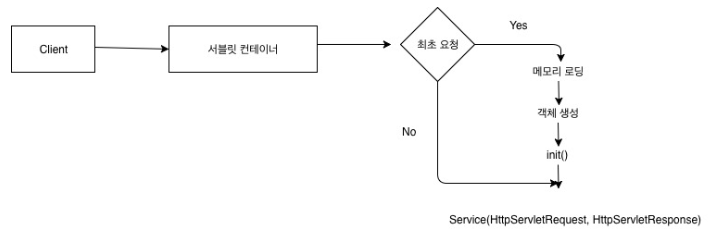

# [1-3강 출처](https://getinthere.tistory.com/11)
## 스프링이란?
### 스프링이란 프레임워크이다.
### 스프링이란 오픈소스이다.
### 스프링은 IoC 컨테이너를 가진다.
- ?Inversion of Control : `제어의 역전`
    - 주도권을 빼앗겼다. 주도권이 스프링한테 있다.
    - 내가 Object를 해서, new해서 heap 메모리 공간에 올리게 되면, 이건 내가 직접 new를 함. 
    - `의자 s = new 의자();` <-- reference s는 new를 만든, 메서드 내부에서 관리하게 된다.
        - 각각의 메서드가 관리하면, 메모리를 공유하는 것이 힘들다. 각각 new하게 되면.. 
    - `Class`: 설계도
    - `Object`: 실체화가 가능한 것
    - `Instance`: 실체화된 것
### 스프링은 DI를 지원한다.
- `Dependency Injection`: 의존성 주입
- 예전에는 개발자가 객체를 관리했다면, 스프링이 스캔해서 띄웠기 때문에(IoC)
- 내가 원하는 모든 곳(클래스의 메서드)에서 가져와서 사용할 수 있다!
- 스캔을 하면, 딱 한 번만 객체가 만들어지고, 어디에서든 사용할 수 있게 된다. --> `DI`
### 스프링은 엄청나게 많은 필터를 가지고 있다.
- 필터: 문지기(임무)
- 스프링 자체가 갖는 필터 기능(사용), 직접 필터를 생성해서 사용도 가능. 
- `성`: 톰캣 :(필터;web.xml)
- `왕의집`: 스프링 컨테이너(필터;인터셉터, `AOP 개념`)
### 스프링은 엄청나게 많은 어노테이션을 가지고 있다.(리플렉션, 컴파일 체킹)
- 컴파일 체킹
    - `어노테이션(주석 + 힌트)` <- 컴파일러가 무시하지 않음
        - 주로 객체 생성을 한다. 
        - `@Autowired`: 로딩된 객체를 해당 변수에 집어 넣어. (약속)
        - `@Component`: 클래스를 메모리에 로딩
        - `@Bean`: 
    - `리플렉션`
        - 런타임 시 분석
        - 스프링에서 클래스를 heap메모리에서 스캔할 때, B클래스 내부에 어떤 애들이 있는지 분석하는 것(같은 타입을 찾아서, DI해줌.)
        - 특정 클래스 내부에 있는 필드, 메소드, 어노테이션이 있는지 체킹할 수 있다.
        - 있다면 설정할 수 있다.
        - `@Controller`
    - `//(주석)` <- 컴파일러가 무시하는 것이 주석
    - Dog 상속 
### 스프링은 MessageConverter를 가지고 있다. 기본값은 현재 JSON이다.
- 영어권, 한국인 사이에서 통신 주고받고 싶다. 
- 자바 언어를 JSON으로 컨버팅해주는 것이 MessageConverter이다.
### 스프링은 BufferedReader와 BufferedWriter를 쉽게 사용할 수 있다.
- 전기선(전류)을 통해 데이터 통신이 이뤄진다. (bit 단위)
- InputStreamReader: 문자 하나, 배열!(여러 개의 문자); 단점: 크기가 정해져 있어야함. 
- BufferedReader로 감싸면, ByteStream으로 데이터의 가변길이의 문자를 받을 수 있다.
- 통신을 할 때 보면, 요청 시 데이터를 담아서!
    - (jsp: request.getReader(), BufferedWriter 대신 PrintWriter)
    - @ResponseBody -> BufferedWriter가 동작한다. 
    - @RequestBody -> BufferedReader가 동작한다. 
### 스프링은 계속 발전중이다.

---

## 4강 Springboot with JPA - JPA 개념잡기
## 1. JPA란?
### JPA는 Java Persistence API다.
- RAM(전기, 휘발성) - 컴퓨터가 꺼지면 다 사라진다. 
- 하드디스크에 기록하게 되면, 하드디스크는 비휘발성이기에 영구적 저장. 
- 영속성: 어떤 데이터가 영구적으로 기록될 수 있게 해준다.
- JAVA에서는 데이터 저장을 파일시스템/하드디스크에 하는건 아니다. 
    - (DBMS를 하드디스크의 일부를 관리,저장한다.)
>- 영속성: 데이터를 생성한 프로그램의 실행이 종료되더라도, 사라지지 않는 데이터의 특성을 의미한다.
####  API가 뭐죠?
- Application: 프로그램 
- Programming: 프로그래밍 
- Interface: 인터페이스? -> ex) 프로토콜, 인터페이스 개념
    - A, B(힘이 가장셈), C : B가, "이제부터 나에게 연락할 땐 전화하지 말고 직접 찾아와"
    - 그 규칙을 지켜야하는 상황-> `인터페이스`에 맞춰서 직접 걸어서 연락해야한다.
    - 프로그램을 하나 만들었어. a,b 두 기능 공유하고 싶은데, a 데이터 사용을 원하면, 밤 12시부터 새벽 6시까지만 가능해. 인터페이스를 만듦 (상하관계가 존재하는 약속)
- 프로토콜: A, C가 싫어! A, B, C 모두 동등한 관계. 수많은 프로토콜로 만들어진 것. 서로 3명이 동의할 수 있는 프로토콜: `email로 연락하자.`
- JPA: Java Persistence Application Programming Interface이기 때문에, 
    > - 자바 프로그래밍할 때 데이터를 영구적으로 저장하기 위한 인터페이스: JPA입니다.

### JPA는 ORM 기술이다.
- ORM: `Object Relational Mapping`
- 나의 하인같은 것이다!
- 어떤 클래스를 만든다고 가정, 모델 클래스. 건물을 짓는 설계도, 2d로 만들어져 있다. 건물 올리게 되면, 3d로 형성: 모델링한다(추상적인 개념을 현실 세계로 뽑아내는 것)
- ex) Team 테이블 (id, name, year)
```java
class Team{
    int id; 
    String name;
    String year;
}
// 자바 세상에 모델링
// 상황이 역전됨!
// class 를 먼저 만들고, -> 테이블을 자동 생성할 수 있다.
// JPA의 인터페이스 규칙을 지키면 -> 테이블을 자동 생성되게 하는 기법.: ORM
```

### JPA는 반복적인 CRUD 작업을 생략하게 해준다.
- select 1건, select all, delete, update, insert 1건 
- 자바 -> DB 커넥션 요청을 한다. 신분을 확인하고 세션을 오픈하면, Connection진행 -> 쿼리를 전송할 수 있다. DB는 어떤 역할을 수행해서 데이터를 만들어내고 -> 응답한다. 자바는 자바 object로 변경을 해야한다. (JSON으로)
### JPA는 영속성 컨텍스트를 가지고 있다.
- 자바에서는 파일 시스템이 아니라, 데이터베이스에 저장을 한다.(mysql)
- `컨텍스트`: 영숙이의 모든 것을 다 알고 있다는 것! 대상의 모든 정보를 가지고 있음. 
- ORM에서는, DB가 있는데 그 데이터가 동물 데이터를 하나 만듦, 
DB에 다이렉트로 접근하는 것이 아니라, 중간에 `영속성 컨텍스트`가 알고 있음. (동물 데이터)를 영속성 컨텍스트에 던져주고, DB에 저장.
- 영속성 컨텍스트와 DB가 동기화된다. 
- 과일 데이터를 줘! 
    - 과일 데이터 내놔! 영속성 컨텍스트에서는 java object 
    - 다시 자바에 돌려줌. 3개의 과일 데이터는 일치하게 됨. 
    - 자바-과일 데이터의 내용 변경하면, 영속성 컨텍스트가 변경됨. DB에 커밋해서 데이터를 밀어넣으면, type이 사과 != 딸기 다르면, update가 일어난다. 일련의 모든 정보를 영속성 컨텍스트를 통해 모두 관리.
### JPA는 DB와 OOP의 불일치성을 해결하기 위한 방법론을 제공한다. (DB는 객체저장 불가능; 자바는 객체 저장 가능)
```java
class Team{
    int id;
    String name;
    String year;
}

class Player{
    int id; 
    String name;
    Team team; // team 오브젝트 JPA가 자동으로 매핑해서 넣어줌. 
    // int teamId; --> X
}
```

### JPA는 OOP의 관점에서 모델링을 할 수 있게 해준다.(상속, 컴포지션, 연관관계)
- 상속, 컴포지션
```java
class Car{
    int id; // pk
    String name;
    String color;
    Engine engine;
}

class Engine extends EntityDate{
    int id;
    int power;
}
class EntityDate{
    TimeStamp createDate;
    TimeStamp updateDate;
}
```
- 연관관계
### 방언 처리가 용이하여 Migration 하기 좋음. 유지보수에도 좋음. 
- 스프링 -> JPA(dialect;방언: mysql, oracle 등..) / 추상화 객체 -> DB
    - 추상화객체를 바라보기 때문에, 뭐가 됐든 연결해서 처리하기 좋음. 
### JPA는 쉽지만 어렵다. 
---
## 서블릿 


## 톰켓이란
- URL(location): 자원의 위치를 요청. a.html, a.avi 
- URI(identifier): 
- 웹서버: 아파치 (정적인 파일, 요청한 파일을 돌려준다.) + 톰캣 
    - 자기가 이해하지 못하는 파일이 오면, 제어권을 톰캣에게 넘겨준다.
- 톰캣: .jsp 파일의 자바 코드를 모두 컴파일 하고, 
    컴파일이 끝나면 데이터를 .html에 덮어씌워 만들어 아파치에게 돌려준다. 
    - 아파치는 .html 을 응답해준다. 

## web.xml(웹 배포 서술자)
- ServletContext의 초기 파라미터 
- Session의 유효시간 설정
- Servlet/JSP에 대한 정의
    - 여기에서 Servlet/JSP 매핑 시 (web.xml에 직접 매핑 or @WebServlet 어노테이션 사용)에 모든 클래스에 매핑을 적용시키기에는 코드가너무 복잡해지기 때문에 FrontController 패턴을 이용한다.
- Mime Type 매핑
- Welcome File list 
- Error Pages 처리 
- 리스너/필터 설정 
- 보안

> 이 사람이 왜 이렇게 만들었을까를 생각해보는 것이 중요하다.
## FrontController
- 최초 앞단에서 request 요청을 받아서 필요한 클래스에 넘겨준다. 
    - 왜? web.xml에 다 정의하기가 너무 힘듦
- 이때 새로운 요청이 생기기 떄문에, request와 response가 새롭게 new될 수 있다. 
- 그래서 아래의 RequestDispatcher가 필요하다.
## RequestDispatcher
- 필요한 클래스 요청이 도달했을 떄, FrontController에 도착한 request와 response를 그대로 유지시켜준다. 

## DispatchServlet
- FrontController 패턴을 직접 짜거나, RequestDispatcher를 직접 구현할 필요가 없다. 왜냐하면 스프링에는 DispatchServlet이 있기 때문이다.
- DispatchServlet은 `FrontController 패턴 + RequestDispatcher`이다.
- DispatchServlet이 자동생성되어질 때 수많은 객체가 생성(IoC)된다. 보통 필터들이다. 
- 해당 필터들은 내가 직접 등록할 수도 있고, 기본적으로 필요한 필터들은 자동 등록되어진다. 

## 스프링 컨테이너
> - DispatchServlet에 의해 생성되어지는 수많은 객체들은 어디에서 관리될까?
### 첫째, ApplicationContext
- 수많은 객체들이 ApplicationContext에 등록된다. 이것을 `IoC`라고 한다.
    - DispatcherServlet이 Component 스캔할 때 등록된다.
    - 스캔이란: 메모리에 로딩한다는 뜻.
- IoC란 제어의 역전을 의미한다. 
- 개발자가 직접 new를 통해, 객체를 생성하게 된다면, 해당 객체를 가리키는 레퍼런스 변수를 관리하기 어렵다. 
    - 그래서 스프링이 직접 해당 객체를 관리한다. (어떤 어노테이션을 붙여서 IoC가 관리할 수 있게)
    - 이때 우리는 주소를 몰라도 된다. 
        - 왜냐하면 필요할 떄 DI하게 되면 되기 때문이다. 
- DI를 의존성 주입이라고 한다.
    - 필요한 곳에서 ApplicationContext에 접근하여 필요한 객체를 가져올 수 있다.
- ApplicationContext는 싱글톤으로 관리되기 때문에 어디에서 접근하든 동일한 객체라는 것을 보장해준다. 
    - ApplicationContext의 종류에는 두 가지가 있는데, `root-applicationContext`와 `servlet-applicationContext`이다.
- servlet-applicationContext는 ViewResolver, Interceptor, MultipartResolver 객체를 생성하고, 웹과 관련된 어노테이션 Controller, RestController를 스캔한다.
> --> 해당 파일은 DispatchServlet에 의해 실행된다.
- root-applicationContext는 해당 어노테이션을 제외한 어노테이션 ServiceRepository 등을 스캔하고 DB관련 객체를 생성하낟. (스캔이란: 메모리에 로딩)
> - 해당 파일은 ContextLoaderListener에 의해 실행된다. 
> - ContextLoadListener를 실행해주는 녀석은 web.xml이기 때문에 root-applicationContext는 servlet-applicationContext보다 먼저 로드가 된다. 
> - 당연히 servlet-applicationContext에서는 root-applicationContext가 로드한 객체를 참조할 수 있지만 그 반대는 불가능하다. 생성 시점이 다르기 때문이다. 

### 둘째, Bean Factory
- 필요한 객체를 Bean Factory에 등록할 수도 있다. 
- 여기에 등록하면, 초기에 메모리에 로드되지 않고, 필요할 때 `getBean()`이라는 메소드를 통하여 호출하여 메모리에 로드할 수 있다. (최근에는 어노테이션으로)
- 이것 또한 IoC이다. 그리고 필요할 때 DI하여 사용할 수 있다. 
- ApplicationContext와 다른 점은, Bean Factory에 로드되는 객체들은 미리 로드되지 않고, 필요할 때 호출하여 로드하기 때문에 lazy-loading이 된다는 점이다.


## 스프링부트가 응답(Response)하는 방법
## 요청 주소에 따른 적절한 컨트롤러 요청(Handler Mapping)
- GET 요청 -> http://localhost:8080/post/1
- 해당 주소로 요청이 오면, 적절한 컨트롤러의 함수를 찾아 실행한다.
## 응답
- html 파일을 응답할지, Data를 응답할지 결정해야 하는데, html 파일을 응답하게 되면 ViewResolver가 관여하게 된다. 
- 하지만 Data를 응답하게 되면, MessageConverter가 작동하게 되는데, 메시지를 컨버팅할 때 기본전략은 json이다.

---
- ① request 
    - ② web.xml
        - ③ ContextLoader Listener
        - 서블릿이 만들어지면 -> 스레드가 만들어짐(서로 독립적이라 영향x)
        - 충돌날 일이 없음. 모든 요청하는 애들이 공통으로 쓰일 수 있는 것 -> Database Connection
        - 데이터베이스와 관련된 것, 모든 스레드 관련된 것은 여기서 띄움. 
        - ④ root_ApplicationContext라는 파일이 있는데, .xml파일로 커스터마이징 할 수 있음. 
        >- ContextLoaderListener: 공통적으로 쓰이는 애들을 메모리에 띄워주고 IoC컨테이너에서 관리해준다. 
        - Db에서는 dispatcherServlet에서 띄운 애한테 접근을 못한다. db가 먼저 뜨기 때문.. 
        - DispatcherServlet에서 반대로 DB에 접근이 가능하다. 클래스에서 각각 필요할 때마다 쓴다. 

            - DispatchServlet
            - 특정 패키지 밑의 자바 파일은 모두 뒤져서, 필요한 것들을 메모리에 올려주고, 주소를 분배한다. 
                - 뭐가 필요하고 안필요한거죠?
                - @Controller(스캔할 때 메모리에 다 띄워), @RestController, @Configuration, @Repository, @Service, @Component - 특정 목적에 의해 정해둠. 역할을 알아야 한다. 어떤 어노테이션으로 메모리를 띄울 수 있는지 방법을 알아야 사용할 수 있다. @Hello로도 만들 수 있긴 함. 
                > 기본적으로 제공하는 어노테이션으로 웹 서비스를 구축할 수 있어야 한다. 
            - (주소 분배 역할, 컴포넌트 스캔; FrontController + RequestDispatcher의 결합)
            - 주소를 분배하기 전에, 메모리에 떠있어야 한다.
            - ex) java의 경우 src에 모여있음..일단 메모리에 떠있으려면 new가 필요하다.
            - static으로 만든 파일과 자바파일과는 다르다.
            - static은 main메소드 실행하기 전부터 떠있음.
            - 생성과 사라짐이 있는 애는 `객체`이다.

